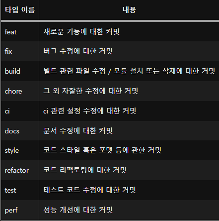

### Component

이는 React에서 가장 기본적인 단위로, 재사용 가능한 UI 요소를 만드는 데 사용됩니다. Component는 독립적이며, 애플리케이션의 다른 부분에 종속되지 않습니다1. 예를 들어, 버튼, 입력 필드, 카드 등은 모두 Component로 만들 수 있습니다.

### Layout

Layout은 앱의 사용자 인터페이스 구조를 나타냅니다1. 이는 주로 React 스마트 컴포넌트를 참조하며, 이들 스마트 컴포넌트는 재사용 가능한 컴포넌트를 로드합니다1. 예를 들어, 헤더와 푸터가 있는 웹사이트의 기본 레이아웃을 생각해볼 수 있습니다.

### Page

Page는 Layout과 비슷하지만 페이지 수준에서 작동합니다1. 각 페이지는 레이아웃을 포함하고 컴포넌트를 참조합니다1. 예를 들어, ‘홈페이지’, ‘제품 페이지’, ‘연락처 페이지’ 등이 있습니다.

### 집합 관계

여러 Component들이 하나의 Layout을 구성하고, 이 Layout은 다시 Page를 구성합니다.

> Page > Layout > Component의 관계를 가집니다.

### Git Commit Message

d