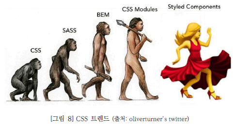

웹 컴포넌트 스타일링 관리: CSS-in-JS vs CSS-in-CSS
2021.09.01우창균
다운로드
들어가며
HTML(Hypertext Markup Language)이 처음 등장한 1991년에는 CSS(Cascading Style Sheets)가 없었다. 웹 이용자들이 늘어나면서 디자인에 대한 요구가 커졌고 웹 고안자들은 HTML을 꾸며주는 언어의 필요성을 공감하게 되었다. 그렇게 해서 1996년 CSS가 발표되었다. 하지만 웹이 점점 복잡해지고 동적 기능 요구가 증가하면서 HTML과 CSS만으로는 화면의 모든 스타일을 제어할 수 없는 상황에 이르렀다. 이를 해결하기 위한 여러 가지 웹 애플리케이션 스타일 구성 방식이 나타났으며 크게 두 갈래로 나뉘어진다. CSS-in-JS와 CSS-in-CSS가 그것이다.

본 아티클에서는 이 두 가지 방식의 장단점과 사용하기 적합한 프로젝트에 대해 살펴보겠다.

CSS-in-CSS란?
CSS 모듈(Module)

CSS 모듈은 CSS를 모듈화 하여 사용하는 방식이다. CSS 클래스를 만들면 자동으로 고유한 클래스네임을 만들어서 scope를 지역적으로 제한한다. 모듈화된 CSS를 번들러로 불러오면 다음과 같이 사용자가 정의했던 클래스네임과 고유한 클래스네임으로 이뤄진 객체가 반환된다.

그림1 CSS 모듈 컴파일 과정입니다. CSS 모듈은 CSS를 모듈화 하여 사용하는 방식이다. CSS 클래스를 만들면 자동으로 고유한 클래스네임을 만들어서 scope를 지역적으로 제한한다. 모듈화된 CSS를 번들러로 불러오면 다음과 같이 사용자가 정의했던 클래스네임과 고유한 클래스네임으로 이뤄진 객체가 반환된다. 자료 출처는 https://www.javascriptstuff.com/what-are-css-modules/ 입니다.

이처럼 CSS 모듈은 동일 프로젝트 소스 안에 CSS 클래스 이름이 중복되어도 새로운 이름이 입혀져 중복 및 관리의 위험성이 적고 CSS 네이밍 규칙이 간소화 된다. 다만 한 곳에서 모든 것을 작성하지 않기 때문에 별도로 많은 CSS 파일을 만들어 관리해야 하는 단점이 있다.

CSS 전처리기(Preprocessor)

자신만의 특별한 구문(Syntax)을 가지고 CSS를 생성하는 프로그램이다. CSS의 문제점을 프로그래밍 방식, 즉 변수·함수·상속 등 일반적인 프로그래밍 개념을 사용하여 보완한다. CSS 전처리기에는 다양한 모듈이 존재하는데 그 중에서도 Sass·Less·Stylus가 가장 많이 사용된다.

CSS 전처리기는 공통 요소 또는 반복적인 항목을 변수 또는 함수로 대체할 수 있는 재사용성, 임의 함수 및 내장 함수로 인해 개발 시간과 비용 절약, 중첩·상속과 같은 요소로 인해 구조화된 코드 유지 및 관리 용이 등의 장점이 있다. 반면 전처리기를 위한 도구가 필요하고 다시 컴파일하는데 시간이 소요된다는 단점도 존재한다.

그림 2 CSS 전처리기 사용량 비교(2019-2020)입니다. Sass(86%-89%)·Less(55%-54%)·Stylus(17%-18%),PostCSS(40%-48%) 자료 출처는 https://2020.stateofcss.com/ko-KR/technologies/pre-post-processors/입니다.

Sass: Sass는 전처리기 중 가장 먼저 나왔다. 초기에는 루비(Ruby) 언어를 기반으로 구동되었는데 언어가 지닌 한계로 컴파일 속도가 느려 후발 주자인 Less에 추월 당한다. 하지만 Node-sass라는 Node.js 기반의 라이브러리가 나오면서 다시 인기를 얻고 있다.

Less: Less는 트위터의 부트스트랩(Bootstrap)에 사용되면서 알려졌다. 브라우저에서 자바스크립트 문법을 취하고 있으며 Node.js 기반으로 구동된다.

Stylus: 상대적으로 프로그래밍 언어의 특징을 많이 가지고 있어 CSS 프로퍼티 내에서 연산자나 함수, 루프 등을 비교적 자유롭게 사용할 수 있다.

CSS-in-JS 란?
CSS-in-JS는 단어 그대로 자바스크립트 코드에서 CSS를 작성하는 방식을 말한다. 2014년 페이스북 개발자인 Christopher Chedeau aka Vjeux가 처음 소개하였다.

그림3 CSS-in-JS입니다. 구분되게 CSS를 작성하는 것이 아니라 JS, HTML, CSS를 함께 처리하는 이미지. 자료 출처는 https://css-tricks.com/a-thorough-analysis-of-css-in-js/입니다.

Vjeux는 CSS를 작성하는 어려움을 다음과 같이 설명하였으며 CSS-in-JS로 이들 이슈를 모두 해결할 수 있다고 강조했다.

Global namespace: 글로벌 공간에 선언된 이름의 명명 규칙 필요
Dependencies: CSS간의 의존 관계를 관리
Dead Code Elimination: 미사용 코드 검출
Minification: 클래스 이름의 최소화
Sharing Constants: JS와 CSS의 상태 공유
Non-deterministic Resolution: CSS 로드 우선 순위 이슈
Isolation: CSS와 JS의 상속에 따른 격리 필요 이슈

그리고 기존 CSS 관리의 어려움을 해결한 페이스북의 사례를 소개하였다. 이후 개념이 발전하면서 많은 라이브러리가 등장했다.

그림4 CSS-in-JS 인기 라이브러리입니다. \* 다운로드 수 기준. 가장 인기가 많은 라이브러리는 Styled Components입니다. 이어서 JSS, Emotion, Aphrodite 순입니다. 자료 출처는 https://www.npmtrends.com입니다.

이 중 가장 대표적인 CSS-in-JS 라이브러리인 Styled Components를 살펴보겠다.

Styled Components는 CSS-in-JS 스타일링을 위한 프레임워크이다. 자바스크립트의 태그가 지정된 템플릿 리터럴과 CSS의 기능을 사용하여 구성 요소에 반응하는 스타일을 제공한다. 장점은 다음과 같다.

CSS 모델을 문서 레벨이 아닌 컴포넌트 레벨로 추상화하는 모듈성
CSS-in-JS는 JavaScript 환경을 최대한 활용
자바스크립트와 CSS 사이의 상수와 함수를 공유
현재 사용 중인 스타일만 DOM에 포함
짧은 길이의 유니크 한 클래스를 자동으로 생성하는 코드 경량화

단점으로는 러닝 커브(Learning Curve), 새로운 의존성 발생, 별도의 라이브러리 설치에 따른 번들 크기 증대 및 CSS-in-CSS에 비해 느린 속도 등을 들 수 있다.

Styled Components는 스타일링을 위한 코드 사용량이 줄어들고 CSS 문법에 친화적이다. 이는 아래 예시를 보면 알 수 있다.

그림5 CSS 기본 작동 방식(좌), Styled- Components 기본 작동 방식(우)입니다. Styled Components는 스타일링을 위한 코드 사용량이 줄어들고 CSS 문법에 친화적이라는 점을 소스코드로 나타내고 있습니다.

CSS-in-JS vs CSS-in-CSS (퍼포먼스 비교)
[그림 6]은 Styled Components에서 확인한 결과이다. 첫 번째 페이지 전환에 358ms가 소요되었다.

그림6 Styled Components 페이지 전환입니다. 첫 번째 페이지 전환에 358ms가 소요되었음을 나타내고 있습니다. 자료 출처는 https://blueshw.github.io/2020/09/27/css-in-js-vs-css-modules입니다./

[그림 7]은 CSS 모듈에서 확인한 결과이다. 첫 번째 페이지 전환에 90.5ms가 소요되었다. Styled Components에 비해서 시간이 줄어들었다. CSS 파일이 추출되는 CSS 모듈 방식은 자바스크립트 해석 과정이 따로 없기 때문에 페이지가 훨씬 빨리 전환된다.

그림7 CSS 모듈 페이지 전환입니다. 첫 번째 페이지 전환에 90.5ms가 소요되었습니다. Styled Components에 비해서 시간이 줄어들었음을 알 수 있습니다. 자료 출처는 https://blueshw.github.io/2020/09/27/css-in-js-vs-css-modules/ 입니다.

마치며
CSS는 1996년에 도입된 이래 [그림 8]과 같이 사용 효율성을 높이는 방향으로 발전해왔다.

그림 8 CSS 트랜드를 진화하는 인간 그림으로 나타내고 있습니다. CSS는 원숭이, SASS는 유인원, BEM은 나무몽둥이를 든 윈시인, CSS Modules은 돌로 만든 무기를 든 인간, Styled Components는 화려한 의상을 입고 하이힐을 신은 금발머리 여성. 자료 출처는 oliverturner's twitter입니다.

지금까지 CSS-in-CSS와 CSS-in-JS를 간단히 살펴보았지만 어떤 방식이 더 낫다고 쉽게 말할 수는 없다. 다만 본인의 경험에 비추어 봤을 때 작업자의 성향이나 판단이 필요한 부분이나 개발 효율성에 중점을 둔 컴포넌트 위주의 프로젝트라면 CSS-in-JS를 고려하는 것이 좋다. 필요한 컴포넌트 페이지의 CSS 스타일 요소만 로딩하기 때문이다. 반면 사용자 편의에 방점을 둔 인터렉티브한 웹 프로젝트라면 랜더링 시 모든 CSS 스타일 요소를 로딩하는 CSS-in-CSS 방식을 권장하는 바이다.

https://s-core.co.kr/insight/view/%EC%9B%B9-%EC%BB%B4%ED%8F%AC%EB%84%8C%ED%8A%B8-%EC%8A%A4%ED%83%80%EC%9D%BC%EB%A7%81-%EA%B4%80%EB%A6%AC-css-in-js-vs-css-in-css/
